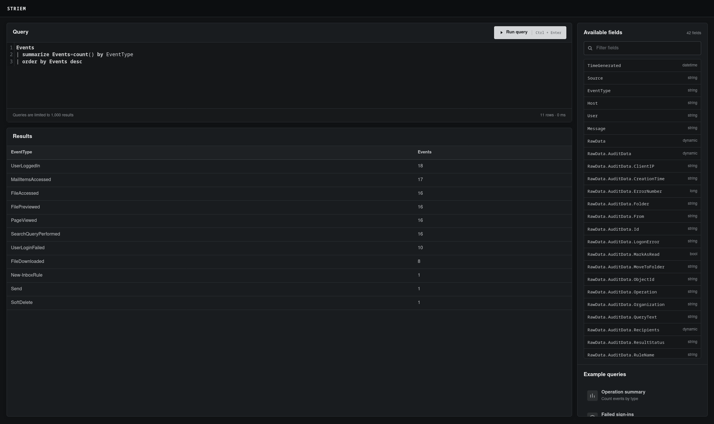

# Striem



Striem is a small, per-team CTF log search application. Challenge operators provision JSON or CSV logs at deployment time, and players use a deliberately limited Kusto Query Language (KQL) subset over dataset tables or the combined `Events` table.

## Run

```bash
node --version
npm ci
npm run build
STRIEM_CONFIG=./testdata/datasets.json go run ./cmd/striem
```

Open <http://localhost:8080>. Data is stored in `./data/striem.db` by default.

For frontend development with hot reload, run the Go service on port 8080 and Vite separately:

```bash
npm run dev
```

Open the Vite URL shown in the terminal. Requests under `/api` are proxied to the Go service.

Configuration:

| Variable | Default | Purpose |
|---|---|---|
| `STRIEM_ADDR` | `:8080` | HTTP listen address |
| `STRIEM_DATA_DIR` | `./data` | Persistent data directory |
| `STRIEM_CONFIG` | unset | Deployment dataset manifest |

## Provision datasets

The player interface has no ingestion or dataset-management controls. Set `STRIEM_CONFIG` to a manifest mounted alongside the prepared logs. Striem imports every configured dataset before opening its HTTP listener and exits if provisioning fails.

Example manifest:

```json
{
  "datasets": [{
    "name": "Northstar Microsoft 365 audit logs",
    "table": "UAL",
    "path": "events.csv",
    "format": "csv",
    "source": "microsoft365",
    "timestampPath": "CreationDate",
    "timestampFormat": "2/01/2006 3:04:05 PM",
    "fieldPaths": {
      "EventType": "Operations",
      "User": "UserIds",
      "Message": "RecordType"
    }
  }]
}
```

Each dataset requires a unique `table` name. Table names must be KQL identifiers and `Events` is reserved for the union of all configured datasets. Relative paths are resolved from the manifest directory. Supported inputs are NDJSON, JSON arrays, CSV with a header row, and gzip-compressed variants. The optional `format` is `auto`, `json`, or `csv`; auto-detection selects CSV for `.csv` and `.csv.gz` paths and JSON otherwise. Explicit `format` can override the extension.

CSV headers become top-level `RawData` fields and cells remain strings, preserving identifiers such as `00123`. Empty or duplicate headers and inconsistent row lengths are rejected. Numeric CSV timestamps require an explicit `unix` or `unix_ms` timestamp format. Headers containing dots use escaped [GJSON paths](https://github.com/tidwall/gjson/blob/master/SYNTAX.md) in mappings, such as `host\.name`.

Mappings use GJSON paths for every format. JSON objects or arrays encoded inside string fields are parsed automatically, including JSON stored in CSV cells, so fields such as `RawData.AuditData.ClientIP` can be queried directly. Each configured dataset atomically replaces a previous dataset with the same name, and datasets absent from the manifest are removed. Timestamps are normalized to UTC but are not rebased. Expanded inputs are limited to 128 MiB and each event to 2 MiB.

## Docker

```bash
docker build -t striem .
docker run --rm -p 8080:8080 \
  -v striem-data:/data \
  -v "$PWD/testdata:/config:ro" \
  -e STRIEM_CONFIG=/config/datasets.json \
  striem
```

## Query

Query a configured dataset directly by its manifest table name:

```kusto
UAL
| where EventType == "UserLoginFailed"
| take 100
```

`Events` remains available as a union of every configured table:

Every table exposes the normalized columns below. Mappings may leave optional columns null; the complete source record remains in `RawData`.

Available columns:

```text
TimeGenerated  datetime
Source         string
EventType      string
Host           string
User           string
Message        string
RawData        dynamic
```

Example:

```kusto
Events
| where EventType == "UserLoginFailed"
| extend ClientIP = tostring(RawData.AuditData.ClientIP)
| summarize Failures=count() by ClientIP
| order by Failures desc
```

The web interface groups discovered JSON fields by table. Selecting a field inserts its path into the query editor. Keys that are not valid KQL identifiers use bracket access:

```kusto
Events
| project Value = RawData["field.with.dots"]
| order by TimeGenerated desc
```

Supported tabular operators:

```text
where, project, extend, summarize, distinct, order by, sort by,
top, take, limit, count, union, join
```

`union` appends rows from tables or parenthesized pipelines with the same column names. Columns are aligned by name:

```kusto
UAL
| project TimeGenerated, User, Host
| union (Sysmon | project Host, User, TimeGenerated)
| order by TimeGenerated desc
```

`join` correlates parenthesized pipelines on one or more same-name columns. It defaults to `inner` and also supports `leftouter`. Right-side key columns are omitted, while other duplicate names receive numeric suffixes such as `Host1`:

```kusto
UAL
| project User, TimeGenerated
| join kind=inner (
    Sysmon
    | project User, Host, Message
  ) on User
```

Supported scalar operations:

```text
==, !=, <, <=, >, >=, +, -, *, /, %, and, or, not, in, contains, startswith, endswith
now(), ago(), datetime(), bin(), tostring(), toint(), tolower(),
toupper(), isnull(), isnotnull(), parse_json(), iff(), coalesce(),
strlen(), substring(), strcat()
```

Supported aggregation functions are `count`, `countif`, `dcount`, `sum`, `min`, `max`, and `avg`. Duration literals support milliseconds, seconds, minutes, hours, days, and weeks, such as `500ms`, `15m`, `2d`, or `1w`.

`top N by Expression [asc|desc]` sorts and limits in one operator, defaulting to descending order. Comparisons to `null` use null semantics, so both `Value == null` and `Value != null` are supported alongside `isnull()` and `isnotnull()`.

Scalar variables can be declared before the `Events` pipeline and referenced by later declarations or query expressions:

```kusto
let threshold = 5;
let selectedSource = "sysmon";
Events
| where Source == selectedSource
| top threshold by TimeGenerated
```

Variables are case-sensitive, must be declared before use, and cannot use the same name as an `Events` column. Tabular bindings such as `let subset = Events | where ...` are not supported.

This is a KQL subset, not a complete Kusto engine. Unsupported syntax is rejected with a line and column diagnostic. Queries are limited to five seconds and at most 1,000 rows unless a smaller explicit limit is used.

## API

```text
GET    /api/schema
GET    /api/fields
POST   /api/query
GET    /api/health
GET    /api/ready
```

There is intentionally no built-in authentication. Deploy the service per team behind the CTF platform or an authenticating reverse proxy.

## Test

```bash
go test ./...
```
