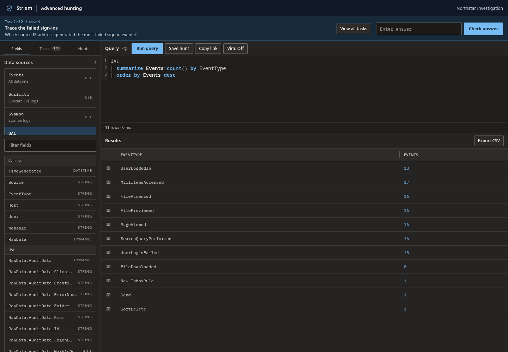

# Striem



Striem is a small, per-team CTF log search application. Challenge operators provision JSON or CSV logs at deployment time, and players use a deliberately limited Kusto Query Language (KQL) subset over dataset tables or the combined `Events` table.

## Run

Local development requires Node.js 22, Go 1.24, and a C toolchain for the SQLite dependency.

```bash
npm ci
npm run build
STRIEM_CONFIG=/path/to/challenge.yaml go run ./cmd/striem
```

Open <http://localhost:8080>. Data is stored in `./data/striem.db` by default.

For frontend development with hot reload, keep the Go service running on port 8080 and start Vite in another terminal:

```bash
npm run dev
```

Open the Vite URL shown in the terminal. Requests under `/api` are proxied to the Go service.

## Frontend

The browser application uses strict TypeScript, Vite, Tailwind CSS 4, and CodeMirror 6. The entry point is `web/src/app.ts`. Shared API contracts are defined in `web/src/types.ts`, while infrastructure and UI behavior are separated into modules under `web/src/features`, `web/src/kql`, and `web/src/ui`.

Most application styling uses Tailwind utilities directly in `web/index.html` and in TypeScript-generated elements. `web/src/style.css` contains the Tailwind theme plus specialized rules for CodeMirror, dynamic table state, JSON highlighting, scrollbars, and other behavior that is not practical to express as static utilities.

Frontend commands:

```bash
npm run check  # Strict TypeScript check
npm run build  # Type-check and create web/dist
npm run dev    # Vite development server
```

The Go binary embeds `web/dist`, so run `npm run build` before compiling or running the Go service from a clean checkout.

Configuration:

| Variable | Default | Purpose |
|---|---|---|
| `STRIEM_ADDR` | `:8080` | HTTP listen address |
| `STRIEM_DATA_DIR` | `./data` | Persistent data directory |
| `STRIEM_CONFIG` | unset | Deployment YAML manifest |

## Provision datasets

The player interface has no ingestion or dataset-management controls. Set `STRIEM_CONFIG` to a manifest mounted alongside the prepared logs. Striem imports every configured dataset before opening its HTTP listener and exits if provisioning fails.

Example manifest:

```yaml
challengeName: Northstar Investigation
flag: striem{northstar_investigation_complete}
submissionCooldown: 3s

questions:
  - id: failed-signin-source
    revision: 1
    title: Trace the failed sign-ins
    prompt: Which source IP generated the most failed sign-ins?
    acceptedAnswers:
      - 198.51.100.77
    caseSensitive: false

datasets:
  - name: Northstar Microsoft 365 audit logs
    table: UAL
    path: events.csv
    format: csv
    source: microsoft365
    timestampPath: CreationDate
    timestampFormat: 2/01/2006 3:04:05 PM
    fieldPaths:
      EventType: Operations
      User: UserIds
      Message: RecordType
```

`challengeName` is optional, limited to 120 characters, and displayed in the navigation bar. Each dataset requires a unique `table` name. Table names must be KQL identifiers and `Events` is reserved for the union of all configured datasets. Relative paths are resolved from the manifest directory. Supported inputs are NDJSON, JSON arrays, CSV with a header row, and gzip-compressed variants. The optional `format` is `auto`, `json`, or `csv`; auto-detection selects CSV for `.csv` and `.csv.gz` paths and JSON otherwise. Explicit `format` can override the extension.

Investigation questions are optional and share progress across everyone using the deployment. Question IDs must be unique lowercase identifiers. Answers are trimmed and matched case-insensitively by default; `acceptedAnswers` can contain aliases. Incorrect submissions are tracked and limited by `submissionCooldown`, which defaults to three seconds. The final `flag` is returned only after every configured question is solved. Increment a question's `revision` when changing its accepted answers to reset that question's progress. The successfully submitted answer is persisted with shared progress and shown after a task is solved. Configured accepted answers and the flag remain in process memory, so the YAML manifest must be supplied on every startup and kept inaccessible to players.

CSV headers become top-level `RawData` fields and cells remain strings, preserving identifiers such as `00123`. Empty or duplicate headers and inconsistent row lengths are rejected. Numeric CSV timestamps require an explicit `unix` or `unix_ms` timestamp format. Headers containing dots use escaped [GJSON paths](https://github.com/tidwall/gjson/blob/master/SYNTAX.md) in mappings, such as `host\.name`.

Mappings use GJSON paths for every format. JSON objects or arrays encoded inside string fields are parsed automatically, including JSON stored in CSV cells, so fields such as `RawData.AuditData.ClientIP` can be queried directly. Changed datasets atomically replace previous datasets with the same name, while unchanged files and mappings reuse their existing imported data. Datasets absent from the manifest are removed. Timestamps are normalized to UTC but are not rebased. Expanded inputs are limited to 1 GiB and each event to 2 MiB.

## Docker

```bash
docker build -t striem .
docker run --rm -p 8080:8080 \
  -v striem-data:/data \
  -v "/path/to/config:/config:ro" \
  -e STRIEM_CONFIG=/config/challenge.yaml \
  striem
```

The Dockerfile uses separate Node.js and Go build stages. The Node.js stage installs the locked frontend dependencies, performs the strict TypeScript check, and builds the Tailwind/Vite assets. The Go stage embeds those generated assets into a single stripped binary. The runtime image contains only the binary and its writable `/data` volume; Node.js, the TypeScript sources, and build tools are not included.

### Cloudflare deployment

The repository includes `compose.cloudflare.yml` for the public test deployment at <https://striem.k3ng.xyz>. It keeps the application port private and routes traffic through the `striem-k3ng` named Cloudflare Tunnel:

```bash
docker compose -f compose.cloudflare.yml up -d --build
docker compose -f compose.cloudflare.yml ps
docker compose -f compose.cloudflare.yml logs -f
```

The tunnel credentials remain outside the repository at `~/.cloudflared/efda31a1-6210-47ae-9f9f-69bee47f372a.json`. Stop the deployment without deleting investigation data using `docker compose -f compose.cloudflare.yml down`. Add `-v` only when intentionally resetting the imported data and shared question progress.

## Query

Query a configured dataset directly by its manifest table name:

```kusto
UAL
| where EventType == "UserLoginFailed"
| take 100
```

`Events` remains available as a union of every configured table:

Every table exposes the normalized columns below. Mappings may leave optional columns null; the complete source record remains in `RawData`.

Available columns:

```text
TimeGenerated  datetime
Source         string
EventType      string
Host           string
User           string
Message        string
RawData        dynamic
```

Example:

```kusto
Events
| where EventType == "UserLoginFailed"
| extend ClientIP = tostring(RawData.AuditData.ClientIP)
| summarize Failures=count() by ClientIP
| order by Failures desc
```

The web interface groups discovered JSON fields by table. Selecting a field inserts its path into the query editor. Keys that are not valid KQL identifiers use bracket access:

```kusto
Events
| project TimeGenerated, Value = RawData["field.with.dots"]
| order by TimeGenerated desc
```

The browser keeps recent queries, named saved queries, bookmarked result rows, and bookmark notes in local storage. Share creates a URL containing the current query. Results that include `TimeGenerated` also display a histogram of the visible rows.

Supported tabular operators:

```text
where, search, project, extend, summarize, distinct, order by, sort by,
top, take, limit, count, mv-expand, mv-apply, union, join
```

`search` performs case-insensitive whole-token matching across every currently visible column, including `RawData`:

```kusto
Events
| search "powershell"
```

`union` appends rows from tables or parenthesized pipelines with the same column names. Columns are aligned by name:

```kusto
UAL
| project TimeGenerated, User, Host
| union (Sysmon | project Host, User, TimeGenerated)
| order by TimeGenerated desc
```

`join` correlates parenthesized pipelines on one or more same-name columns. It defaults to `inner` and also supports `leftouter` and `leftanti`. `leftanti` returns left-side rows with no matching right-side row. Right-side key columns are omitted, while other duplicate names receive numeric suffixes such as `Host1`:

```kusto
UAL
| project User, TimeGenerated
| join kind=inner (
    Sysmon
    | project User, Host, Message
  ) on User
```

Supported scalar operations:

```text
==, !=, =~, !~, <, <=, >, >=, +, -, *, /, %, and, or, not,
in, in~, !in, !in~, contains, contains_cs, startswith, startswith_cs,
endswith, endswith_cs, has, has_cs, has_any, has_all
now(), ago(), datetime(), bin(), tostring(), toint(), tolower(),
toupper(), isnull(), isnotnull(), parse_json(), iff(), coalesce(),
strlen(), substring(), strcat(), split(), extract(), trim(), replace_string()
```

Dynamic arrays support zero-based indexing such as `RawData.tags[0]`. `mv-expand Name=Expression [limit N]` expands an array into rows. Expansion defaults to 128 values per input row, cannot exceed 128, and considers at most 1,000 input rows per expansion stage:

```kusto
Events
| extend Recipients=RawData.AuditData.Recipients
| mv-expand Recipient=Recipients limit 32
| where tostring(Recipient) has "example.com"
```

`mv-apply Name=Expression [limit N] on (where ... | summarize ...)` filters and aggregates an array independently for each input row. The subquery supports zero or more `where` operators followed by one `summarize` without `by`; `arg_min` and `arg_max` are not supported inside `mv-apply`. The same 128-value and 1,000-input-row bounds apply:

```kusto
Events
| mv-apply Tag=RawData.tags on (
    where Tag in~ ("suspicious", "admin")
    | summarize Matches=make_list(Tag), MatchCount=count()
  )
| where MatchCount > 0
```

`has` performs case-insensitive whole-token matching; `_cs` variants are case-sensitive and `in~` performs case-insensitive membership. `extract()` uses Go's bounded RE2 regular-expression syntax and accepts a pattern, capture-group index, and source string.

Supported aggregation functions are `count`, `countif`, `dcount`, `sum`, `min`, `max`, `avg`, `make_set`, `make_list`, and `take_any`. `make_set` and `make_list` return dynamic arrays, omit null values, and retain at most 1,000 values or 1 MiB of encoded data per group. `arg_max(Value, *)` and `arg_min(Value, *)` return the complete row containing the extreme value; they must be the only aggregation in that `summarize`. Duration literals support milliseconds, seconds, minutes, hours, days, and weeks, such as `500ms`, `15m`, `2d`, or `1w`.

`top N by Expression [asc|desc]` sorts and limits in one operator, defaulting to descending order. Comparisons to `null` use null semantics, so both `Value == null` and `Value != null` are supported alongside `isnull()` and `isnotnull()`.

Scalar variables and reusable tabular pipelines can be declared before the main query:

```kusto
let threshold = 5;
let selectedSource = "sysmon";
let selectedEvents = Events | where Source == selectedSource;
selectedEvents
| top threshold by TimeGenerated
```

Bindings are case-sensitive, must be declared before use, and cannot use the same name as an `Events` column. Tabular bindings require a pipeline on the right side and can be reused as the main source or inside `union` and `join` pipelines.

This is a KQL subset, not a complete Kusto engine. Unsupported syntax is rejected with a line and column diagnostic. Queries are limited to five seconds and at most 1,000 rows unless a smaller explicit limit is used.

## API

```text
GET    /api/schema
GET    /api/fields
GET    /api/questions
POST   /api/questions/{id}/answer
POST   /api/query
POST   /api/query/validate
GET    /api/health
GET    /api/ready
```

There is intentionally no built-in authentication. Deploy the service per team behind the CTF platform or an authenticating reverse proxy.

State-changing API requests require `Content-Type: application/json` and `X-Striem-Request: 1`. Browser requests are additionally checked using `Origin` and `Sec-Fetch-Site`; cross-origin submissions are rejected. These checks provide CSRF protection but do not replace authentication or proxy access controls.

`POST /api/query/validate` parses and compiles a query without executing it. Valid queries return `204 No Content`; invalid queries return the same positioned diagnostic as `POST /api/query`.

## Test

```bash
npm run check
npm run build
go test ./...
```
