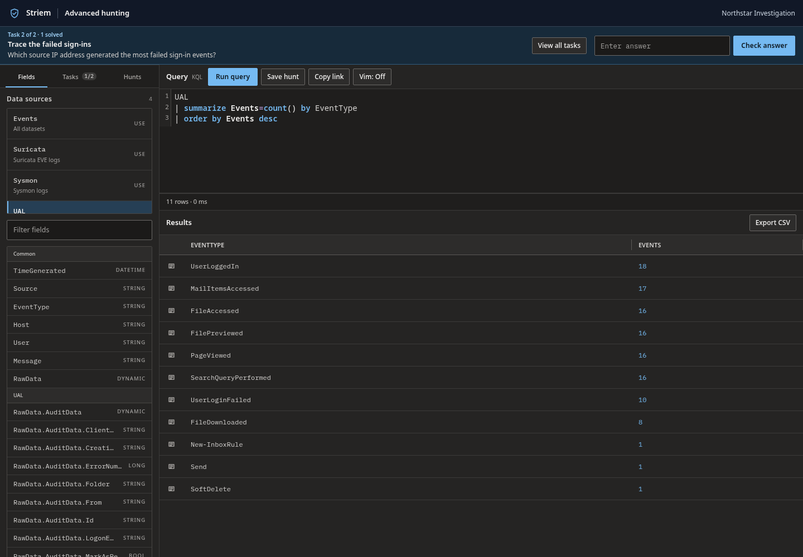

# Striem

Striem is a log investigation and lightweight SIEM application for prepared JSON, CSV, or Windows EVTX telemetry. It can run as a normal KQL hunting workspace or add optional investigation questions and a completion flag for team CTF challenges.

The interface includes live preflight query diagnostics, table and field completion, sortable and resizable results, an event timeline, mobile result cards, saved hunts, and recent hunt history. When questions are configured, it also provides shared task progress and keeps correctly submitted answers visible after each task is solved.



## Run

Local development requires Node.js 22, Go 1.24, and a C toolchain for the SQLite dependency.

```bash
npm ci
npm run build
STRIEM_CONFIG=/path/to/challenge.yaml go run -tags sqlite_fts5 ./cmd/striem
```

Open <http://localhost:8080>. Data is stored in `./data/striem.db` by default.

For frontend development with hot reload, keep the Go service running on port 8080 and start Vite in another terminal:

```bash
npm run dev
```

Open the Vite URL shown in the terminal. Requests under `/api` are proxied to the Go service.

## Frontend

The browser application uses strict TypeScript, Vite, Tailwind CSS 4, and CodeMirror 6. The entry point is `web/src/app.ts`. Shared API contracts are defined in `web/src/types.ts`, while editor, result, timeline, storage, and UI behavior are separated into modules under `web/src/features`, `web/src/kql`, and `web/src/ui`.

Static layout additions use Tailwind utilities directly in `web/index.html` and TypeScript-generated elements. `web/src/style.css` contains the established component styles plus specialized rules for CodeMirror, result tables, JSON highlighting, timelines, and responsive behavior.

Frontend commands:

```bash
npm run check  # Strict TypeScript check
npm run build  # Type-check and create web/dist
npm run dev    # Vite development server
```

The Go binary embeds `web/dist`, so run `npm run build` before compiling or running the Go service from a clean checkout.

## Architecture

```text
cmd/striem/          Process startup and HTTP lifecycle
internal/api/        JSON API, query validation, and static serving
internal/database/   SQLite schema, progress, and KQL SQL functions
internal/deployment/ YAML loading and deployment reconciliation
internal/ingest/     Streaming JSON, NDJSON, CSV, and gzip ingestion
internal/kql/        KQL lexer, parser, AST, and SQL compiler
web/src/             TypeScript application and Tailwind/CSS interface
```

The API parses and compiles every query into parameterized SQLite SQL. `POST /api/query/validate` stops after compilation, while `POST /api/query` executes the same compiled representation with a five-second deadline and a 1,000-row result bound.

Configuration:

| Variable | Default | Purpose |
|---|---|---|
| `STRIEM_ADDR` | `:8080` | HTTP listen address |
| `STRIEM_DATA_DIR` | `./data` | Persistent data directory |
| `STRIEM_CONFIG` | unset | Deployment YAML manifest |
| `STRIEM_MAX_INPUT_BYTES` | `2147483648` | Maximum expanded input size in bytes |

### Logs

Striem writes compact, human-readable logs to standard output. Normal startup output summarizes the loaded deployment instead of printing one line per dataset:

```text
23:48:35 INFO  Deployment loaded  datasets=3  events=805192
23:48:35 INFO  Server listening  address=:8080
```

Routine HTTP access messages are logged at debug level and are omitted from the default output. Warnings and errors remain visible; multiline errors are printed as indented text rather than escaped `\n` sequences. Container deployments can collect the same stream through `docker logs` or their configured logging driver.

## Provision datasets

The browser interface has no ingestion or dataset-management controls. Set `STRIEM_CONFIG` to a manifest mounted alongside the prepared logs. Striem opens its HTTP listener while datasets are imported. The loading screen remains visible until provisioning finishes; failures show an error screen and keep readiness at HTTP 503.

Example manifest:

```yaml
challengeName: Northstar Investigation
flag: striem{northstar_investigation_complete}
submissionCooldown: 3s
fullTextIndex: true

questions:
  - id: failed-signin-source
    revision: 1
    title: Trace the failed sign-ins
    prompt: Which source IP generated the most failed sign-ins?
    acceptedAnswers:
      - 198.51.100.77
    caseSensitive: false

datasets:
  - name: Northstar Microsoft 365 audit logs
    table: UAL
    path: events.csv
    format: csv
    source: microsoft365
    timestampPath: CreationDate
    timestampFormat: 2/01/2006 3:04:05 PM
    indexedPaths: [ClientIP, AuditData.ActorIpAddress]
```

`challengeName` is optional, limited to 120 characters, and displayed in the navigation bar. Each dataset requires a `table` name, and multiple datasets may use the same name to combine several inputs into one logical KQL table. Shared table names must use identical casing. Table names must be KQL identifiers and `Events` is reserved for the union of all configured datasets. Relative paths are resolved from the manifest directory. Supported inputs are NDJSON, JSON arrays, CSV with a header row, Windows EVTX, and gzip-compressed variants. The optional `format` is `auto`, `json`, `csv`, or `evtx`; auto-detection selects CSV for `.csv` and `.csv.gz`, EVTX for `.evtx` and `.evtx.gz`, and JSON otherwise. Explicit `format` can override the extension.

For example, two EVTX inputs can contribute to the same `Sysmon` table while retaining their machine identity in `Source`:

```yaml
datasets:
  - name: Sysmon workstation 01
    table: Sysmon
    path: workstation-01.evtx
    source: workstation-01
    timestampPath: System.TimeCreated.SystemTime
  - name: Sysmon workstation 02
    table: Sysmon
    path: workstation-02.evtx
    source: workstation-02
    timestampPath: System.TimeCreated.SystemTime
```

The former `fieldPaths` dataset option is no longer supported. Root fields are discovered and exposed automatically; remove `fieldPaths` from older manifests before upgrading. The normalized `EventType`, `Host`, `User`, and `Message` columns have also been removed; query the corresponding discovered root fields instead. Existing raw event data is preserved when the legacy physical columns are dropped.

The deployment schema change causes configured datasets to be re-ingested on the first upgraded start so their logical field catalogues can be rebuilt. With `fullTextIndex: true`, this also rebuilds the FTS5 index and can take several minutes for a large deployment. The workspace becomes available after provisioning completes; later starts reuse unchanged imported data.

`indexedPaths` adds SQLite expression indexes for frequently filtered JSON paths. Paths are unioned, deduplicated, and sorted across all datasets, and each segment must be a KQL identifier. Use these indexes for selective equality predicates such as `src_ip == "198.51.100.77"` or `AuditData.ActorIpAddress == "198.51.100.77"`; an explicit cast changes the SQLite expression and cannot use the index. Striem does not push ordinary predicates through the KQL pipeline because SQLite already flattens the generated subqueries.

`fullTextIndex` defaults to `false`. Enabling it builds a contentless FTS5 trigram index over raw JSON plus the system timestamp and source, which accelerates a literal `search` when it is the first operator after a physical table source. The original KQL search remains as an exact recheck. Plan for at least an additional 1.5-2.5x the raw JSON size in disk usage and comparable extra ingestion work; trigram density can cost more. The bundled 805,192-event corpus measured 2.29 GB of additional database space, about 3.2x its source files. Local binaries need `go run -tags sqlite_fts5`; the Docker image includes this build tag by default.

Investigation questions are optional. Omit both `questions` and `flag` to use Striem as a normal SIEM workspace; the task strip and Tasks tab are then removed from the interface. When configured, questions share progress across everyone using the deployment. Question IDs must be unique lowercase identifiers. Answers are trimmed and matched case-insensitively by default; `acceptedAnswers` can contain aliases. Incorrect submissions are tracked and limited by `submissionCooldown`, which defaults to three seconds. The final `flag` is returned only after every configured question is solved. Increment a question's `revision` when changing its accepted answers to reset that question's progress. The successfully submitted answer is persisted with shared progress and shown after a task is solved. Configured accepted answers and the flag remain in process memory, so the YAML manifest must be supplied on every startup and kept inaccessible to users.

CSV headers become top-level query columns and cells remain strings, preserving identifiers such as `00123`. Empty or duplicate headers and inconsistent row lengths are rejected. Numeric CSV timestamps require an explicit `unix` or `unix_ms` timestamp format. Headers containing dots use escaped [GJSON paths](https://github.com/tidwall/gjson/blob/master/SYNTAX.md) for `timestampPath` or `sourcePath`, such as `host\.name`.

EVTX records expose the dynamic top-level columns `System`, `EventData`, and any `UserData`. Common paths include `System.TimeCreated.SystemTime` for `timestampPath` and `System.Provider.Name` for `sourcePath`; values can then be queried directly as `System.EventID.Value`, `System.Computer`, or `EventData.Image`. Human-readable Windows messages are not embedded in most EVTX files.

`timestampPath` and `sourcePath` use GJSON paths for every format. JSON objects or arrays encoded inside string fields are parsed automatically, including JSON stored in CSV cells, so fields such as `AuditData.ClientIP` can be queried directly. Embedded JSON paths discovered during sampling are normalized on later records, and every stored `RawData` object is minified without changing JSON scalar types or number text. Changed datasets atomically replace previous datasets with the same name, while unchanged files and configuration reuse their existing imported data. Datasets absent from the manifest are removed. Timestamps are normalized to UTC but are not rebased.

Valid root-level JSON keys are automatically exposed as logical KQL columns backed by `json_extract`; Striem does not create a physical SQLite column for each field. Nested objects remain dynamic, so a discovered root `process` can be queried as `process.name`. `TimeGenerated`, `Source`, and `RawData` are reserved system names. A conflicting raw key remains available through `RawData`, as do keys that are not valid KQL identifiers. Root keys that differ only by case are omitted from any schema in which they collide because KQL names are case-insensitive.

The field catalogue drives both logical schemas and editor autocomplete. Striem fully discovers fields in records 1 through 5,000 inclusive. After record 5,000, it performs full discovery only for the first record whose exact set of top-level key names has not appeared earlier in the input. Consequently, a nested field first appearing after record 5,000 under an already-seen top-level key set remains queryable but may be absent from autocomplete.

Expanded input is limited to 2 GiB by default and each event is limited to 4 MiB. Set `STRIEM_MAX_INPUT_BYTES` to a positive base-10 integer number of bytes to change the expanded-input limit; invalid, zero, negative, or overflowing values stop import with a configuration error. The expanded limit applies after gzip decompression.

## Docker

Prebuilt Linux images for AMD64 and ARM64 are published to GitHub Container Registry. `latest` follows the `main` branch; versioned releases are also available as `1.2.3`, `1.2`, and `1`. The examples below use `latest`; pin a version tag for repeatable deployments.

The directory mounted at `/config` must contain `challenge.yaml` and any dataset files referenced by relative path from that manifest.

### Docker

```bash
docker pull ghcr.io/kawijayaa/striem:latest
docker run --name striem --restart unless-stopped -p 8080:8080 \
  -v striem-data:/data \
  -v "/path/to/config:/config:ro" \
  -e STRIEM_CONFIG=/config/challenge.yaml \
  ghcr.io/kawijayaa/striem:latest
```

Open <http://localhost:8080>. The web server is available during startup and shows an ingestion screen until the deployment is fully loaded and indexed. To upgrade, pull the desired tag and recreate the container; the named `striem-data` volume preserves the database.

### Docker Compose

Create `compose.yaml` alongside a `config` directory containing the manifest and datasets:

```yaml
services:
  striem:
    image: ghcr.io/kawijayaa/striem:latest
    restart: unless-stopped
    ports:
      - "8080:8080"
    environment:
      STRIEM_CONFIG: /config/challenge.yaml
    volumes:
      - striem-data:/data
      - ./config:/config:ro
    read_only: true
    tmpfs:
      - /tmp:size=64m,mode=1777
    cap_drop:
      - ALL
    security_opt:
      - no-new-privileges:true
    healthcheck:
      test: ["CMD", "wget", "-q", "-O", "/dev/null", "http://127.0.0.1:8080/api/ready"]
      interval: 10s
      timeout: 3s
      retries: 6
      start_period: 90s

volumes:
  striem-data:
```

Start or upgrade the deployment with:

```bash
docker compose pull
docker compose up -d
```

Set the image tag in `compose.yaml` to a published version such as `1.2.3` when the deployment must not change until explicitly upgraded. If the GHCR package is private, authenticate first with a GitHub personal access token that has `read:packages` permission:

```bash
echo "$CR_PAT" | docker login ghcr.io -u USERNAME --password-stdin
```

Striem has no built-in authentication. Do not expose it directly to untrusted networks; place it behind the CTF platform or an authenticating reverse proxy.

### Build locally

```bash
docker build -t striem .
```

The Dockerfile uses separate Node.js and Go build stages. The Node.js stage installs the locked frontend dependencies, performs the strict TypeScript check, and builds the Tailwind/Vite assets. The Go stage embeds those generated assets into a single stripped binary. The runtime image contains only the binary and its writable `/data` volume; Node.js, the TypeScript sources, and build tools are not included.

## Query

Query a configured dataset directly by its manifest table name:

```kusto
UAL
| where Operations == "UserLoginFailed"
| take 100
```

`Events` remains available as a union of every configured table. Its schema contains the union of discovered root fields, and fields absent from a particular event evaluate to null. Conflicting field types are exposed as `dynamic`.

Every table exposes these system columns plus its discovered root fields. The complete source record remains in `RawData`.

Available columns:

```text
TimeGenerated  datetime
Source         string
RawData        dynamic
```

Example:

```kusto
Events
| where Operations == "UserLoginFailed"
| extend ClientIP = tostring(AuditData.ClientIP)
| summarize Failures=count() by ClientIP
| order by Failures desc
```

The web interface lists every available data source and groups discovered JSON fields by table. Selecting a source updates the current query; selecting a field inserts its path into the editor. Keys that are not valid KQL identifiers use bracket access:

```kusto
Events
| project TimeGenerated, Value = RawData["field.with.dots"]
| order by TimeGenerated desc
```

Press `Shift+Enter` in the query editor to run the current query. Press `Ctrl+Enter` to insert a new pipeline line beginning with `|`. JSON badges in query results open that cell's structured value in the searchable JSON viewer.

The navigation bar shows the project and challenge names. The browser keeps recent hunts, named saved hunts, and answer drafts in local storage. Copy link creates a URL containing the current query. Results that include `TimeGenerated` display a selectable histogram of the visible rows.

KQL parsing, schema binding, and relational SQL lowering are provided by [`github.com/kawijayaa/ksql`](https://github.com/kawijayaa/ksql) with a bundled development snapshot in `third_party/ksql` (based on v0.4.0). Supported tabular operators are:

```text
where, filter, search, project, project-away, project-keep, project-rename,
project-reorder, extend, summarize, distinct, count, serialize,
order by, sort by, top, take, limit, sample, sample-distinct, as,
mv-expand, mv-apply, union, join, lookup
```

`project-away`, `project-keep`, and `project-reorder` accept case-sensitive `*` column patterns. Reordering supports `asc`, `desc`, `granny-asc`, and `granny-desc`; the latter two sort embedded ASCII numbers numerically. Overlapping reorder patterns keep each column at its first matching position. Zero-column results remain unsupported.

`join` supports `innerunique` (the KQL default), `inner`, `leftouter`, `rightouter`, `fullouter`, `leftsemi`, `leftanti`, `rightsemi`, and `rightanti`. The default deduplicates the left side by the complete equality-key tuple and keeps one complete representative row; duplicate representatives are unspecified. Use `kind=inner` to retain all matching left rows. Semi/anti joins return only columns from the retained side. `lookup` supports `inner` and `leftouter`. `union` aligns columns by name and type. The default `kind=outer` includes every column, fills missing cells with null, and suffixes conflicting types (for example, `value_long` and `value_string`). `kind=inner` retains common name/type pairs. Standalone `union TableA, TableB` and pipeline unions both work. Wildcard inputs, `withsource`, fuzzy resolution, and zero-column results remain unsupported.

Supported scalar operators include arithmetic and comparisons, Boolean `and`/`or`, membership with `in`, `!in`, `in~`, and `!in~`, ranges with `between`, and `contains`, `startswith`, and `endswith` string matching. Striem's bounded SQLite regular-expression adapter also supports literal alphanumeric terms with `has`, `has_cs`, `hasprefix`, `hassuffix`, their negated forms, `has_any`, and `has_all`.

The compiler supports common casts, conditionals, string and mathematical functions, plus `count`, `countif`, `sumif`, `sum`, `min`, `max`, and `avg`. Striem also maps its bounded SQLite helpers and aggregates: `now`, `ago`, `todatetime`, `parse_json`, `array_length`, `bag_keys`, `bag_has_key`, `set_has_element`, `base64_decode_tostring`, `url_decode`, `ipv4_is_private`, `ipv4_is_in_range`, `split`, `extract`, `trim`, `replace_string`, `make_set`, `make_list`, `make_bag`, `make_bag_if`, and `take_any`.

Additional hunting functions include `not`, `bin`, `startofday`, `endofday`, `startofweek`, `endofweek`, `startofmonth`, `endofmonth`, `startofyear`, `endofyear`, `dcount`, `dcountif`, `count_distinct`, `count_distinctif`, `avgif`, `minif`, and `maxif`.

```kusto
Events
| where not(Source == "noise")
| summarize Events=count(), Sources=dcount(Source) by Hour=bin(TimeGenerated, 1h)
| order by Hour asc
```

`not(expression)` preserves null and returns a Boolean value. `bin` supports numeric values and UTC datetimes with a constant duration (including a scalar `let` binding); timespan-valued bins are not yet supported. Calendar functions accept an optional integer period offset, weeks begin on Sunday, and end-of-period values use Kusto's 100 ns precision. Null or invalid datetime values return null.

Distinct counts ignore nulls. Striem computes `dcount`/`dcountif` **exactly**, unlike Kusto's approximate implementation; their optional constant accuracy argument accepts 0–4 but does not change the exact result. Distinct state is limited to 100,000 values or 4 MiB per group, returning an error instead of a partial count when exceeded. Conditional average/minimum/maximum return null when no non-null values satisfy the predicate.

`make_bag(expr [, maxSize])` and `make_bag_if(expr, predicate [, maxSize])` merge dynamic property bags and skip non-bag values. Duplicate keys keep an unspecified input value. Empty groups return `{}`. `maxSize` must be a constant integer from 1 to 1,048,576 (the default); the deprecated `make_dictionary` alias defaults to 128. Each input bag and aggregate result is limited to 4 MiB; exceeding the byte limit returns a query error.

Reference semantics: [Kusto `not()`](https://learn.microsoft.com/en-us/kusto/query/not-function), [time buckets](https://learn.microsoft.com/en-us/kusto/query/bin-function), and [distinct count](https://learn.microsoft.com/kusto/query/dcount-aggfunction).

Dynamic object properties can use dot or bracket access, and arrays support zero-based bracket indexing:

```kusto
Events
| project Command=tostring(process.name), FirstTag=tags[0]
```

`mv-expand` supports one dynamic array, an explicit output alias, `with_itemindex`, `limit`, and `to typeof(...)`. `mv-apply` supports one dynamic array and row-wise `where`, `extend`, and `serialize` operators. Its inner pipeline does not yet support row-reducing operators such as `summarize`, `top`, or `take`:

```kusto
Events
| mv-apply Item=items on (
    where Item > 1
    | extend Doubled=Item * 2
  )
| project host, Item, Doubled
```

Scalar variables and reusable tabular pipelines can be declared before the main query:

```kusto
let threshold = 5;
let selectedSource = "sysmon";
let selectedEvents = Events | where Source == selectedSource;
selectedEvents
| top threshold by TimeGenerated
```

Bindings are resolved case-insensitively and can be reused as the main source or inside relational pipelines.

This is a relational KQL subset, not a complete Kusto engine. Recognized features without a safe SQLite lowering return a line and column diagnostic rather than being passed through as unchecked SQL. Query source is limited to 32 KiB, execution to five seconds, and returned results to 1,000 rows.

## API

```text
GET    /api/schema
GET    /api/fields
GET    /api/questions
POST   /api/questions/{id}/answer
POST   /api/query
POST   /api/query/validate
GET    /api/health
GET    /api/ready
```

There is intentionally no built-in authentication. Deploy the service per team behind the CTF platform or an authenticating reverse proxy.

`GET /api/health` reports whether the database is reachable. `GET /api/ready` returns `503` while deployment ingestion is running and changes to `200` only after ingestion, indexing, optimization, and query-catalog publication finish. Data API routes also return `503` during that window; static web assets remain available.

State-changing API requests require `Content-Type: application/json` and `X-Striem-Request: 1`. Browser requests are additionally checked using `Origin` and `Sec-Fetch-Site`; cross-origin submissions are rejected. These checks provide CSRF protection but do not replace authentication or proxy access controls.

`POST /api/query/validate` parses and compiles a query without executing it. Valid queries return `204 No Content`; invalid queries return the same positioned diagnostic as `POST /api/query`.

## Test

```bash
npm run check
npm run build
npm test
npx playwright install chromium
npm run test:e2e
go test ./...
go test -tags sqlite_fts5 ./...
go test -race ./...
```

Browser tests use temporary databases and fixtures on ports 18081 and 18082. They do not modify the configured deployment. See [TESTING.md](TESTING.md) for feature coverage and remaining limits.

The compiler snapshot is portable across local and Docker builds. Refresh it from the companion checkout with `python3 scripts/sync-ksql.py ../ksql`; the snapshot retains its license and records source hashes in `third_party/ksql/SNAPSHOT.json`. Run its tests separately with `cd third_party/ksql && go test ./...`. Full-language implementation progress is tracked in [docs/KQL_IMPLEMENTATION.md](docs/KQL_IMPLEMENTATION.md).
